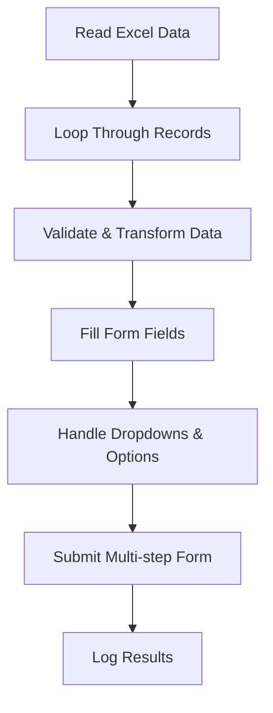

Dưới đây là phiên bản **README được thiết kế lại (chuẩn GitHub, đẹp + chuyên nghiệp + dễ đọc)**:

---

# 📌 Alcohol Form Automation (Data-Driven Testing)

## 📖 Overview

A **data-driven automation tool** built with **C# + Selenium WebDriver** that reads user data from Excel and automatically submits a multi-step alcohol survey form on the HCDC website.

🔗 Website: [https://dgnc.hcdc.vn/alcohol](https://dgnc.hcdc.vn/alcohol)

This project demonstrates the ability to design **end-to-end UI automation**, handle **dynamic elements**, and process **large datasets efficiently**.

---

## 🚀 Key Highlights

* 🚀 Automates **bulk form submission** from Excel data
* 📊 Implements **data-driven testing approach**
* 🧩 Handles **dynamic dropdowns & multi-step forms**
* ❌ Includes **error tracking & logging mechanism**
* 🔄 Applies **data validation & transformation** (DOB, phone, gender)
* ⏱ Uses **explicit waits** to improve test stability

---

## 🛠️ Tech Stack

| Technology         | Purpose                   |
| ------------------ | ------------------------- |
| C# (.NET)          | Core programming language |
| Selenium WebDriver | UI Automation             |
| ClosedXML          | Excel data handling       |
| ChromeDriver       | Browser automation        |

---

## 📂 Test Data

* 📄 Source file: `load_data.xlsx`
* 🧾 Includes: Name | Birthday | Address | Phone

---

## ⚙️ Execution Flow

---

## 📊 Result Tracking

* ✅ Total processed records
* ❌ Failed rows with error details
* ⏱ Execution timestamp

---

## 🎯 What This Project Demonstrates

* ✅ UI Automation with Selenium
* ✅ Data-driven testing design
* ✅ Handling real-world form complexity
* ✅ Writing maintainable automation scripts
* ✅ Debugging & error handling

---

## ⚠️ Limitations

* UI changes may break element locators
* Gender detection uses simple keyword logic
* Not yet structured with Page Object Model (POM)

---

## 🔥 Future Improvements

* Apply **Page Object Model (POM)**
* Integrate **NUnit/TestNG**
* Add **test reporting (Allure / Extent Report)**
* Optimize execution & enable parallel testing

---

## 👨‍💻 Author

**Nguyễn Minh Nguyên**
Manual Tester → Automation Tester

